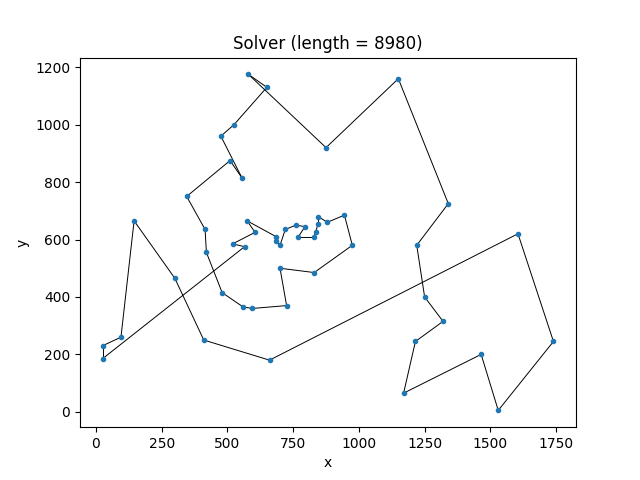
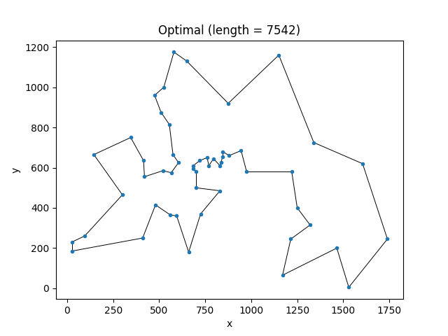

# tsplib-to-kattis
Convert .tsp instances from TSPLIB to Kattis "tsp" instances, compare results and visualize.

## Setup

1. Download TSPLIB instances from http://comopt.ifi.uni-heidelberg.de/software/TSPLIB95/tsp/
2. Run `pip intall -r requirements.txt` to install dependencies if required.
3. Run `python3 tsplib_to_kattis.py -h` to view usage.
